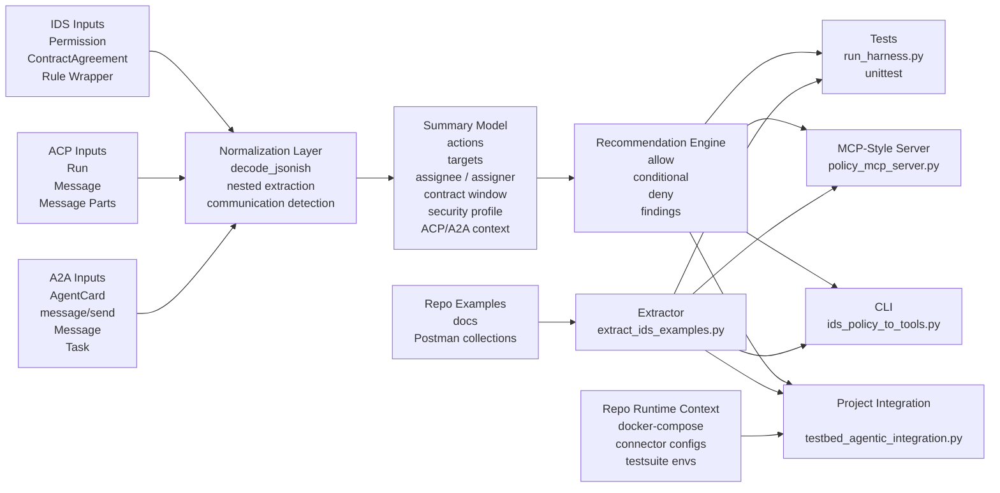
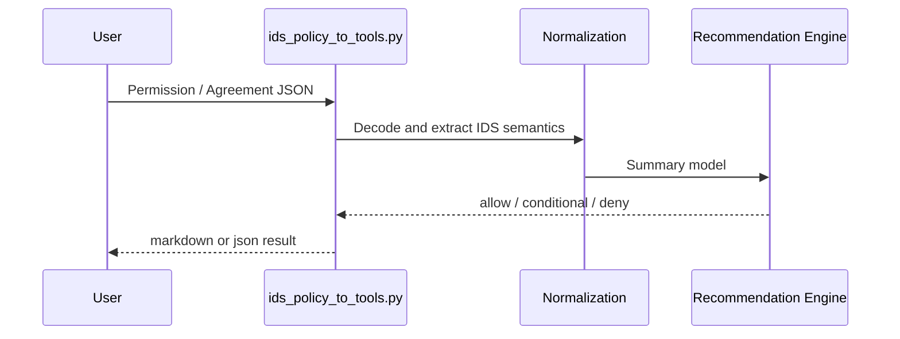
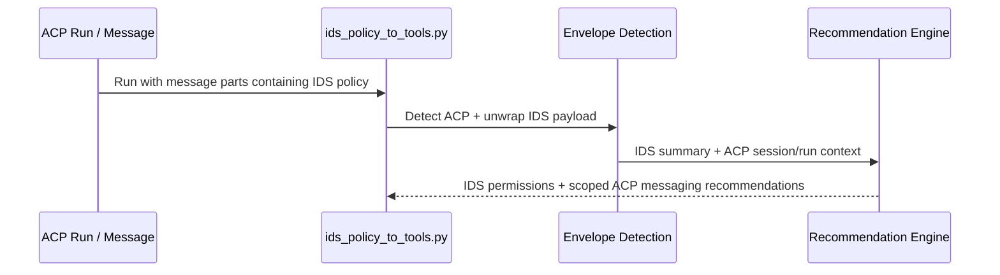
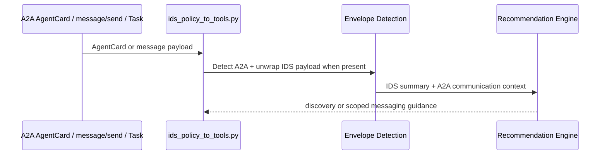

# Architecture

This document describes the architecture of the `ids-policy-to-tools` skill as it exists in this repo.

## Purpose

The skill sits between governed data-space artifacts and agent runtime permissions.

Its job is to:

1. Accept policy-bearing inputs from IDS, ACP, or A2A contexts
2. Normalize them into a single summary model
3. Produce conservative recommendations about what an agent may do next
4. Expose the result through a CLI, a project integration report, an MCP-style server, and repeatable tests

## High-Level View

## Main Components

### 1. Input normalization

File:

- `scripts/ids_policy_to_tools.py`

Responsibilities:

- Parse local files or stdin
- Decode nested JSON strings
- Discover IDS permissions inside wrappers and envelopes
- Detect ACP and A2A communication context

This layer is intentionally tolerant of different envelopes so that the same evaluator can work whether the policy arrives directly, inside a connector payload, inside ACP message parts, or inside A2A messages.

### 2. Summary model

File:

- `scripts/ids_policy_to_tools.py`

Responsibilities:

- Build a compact intermediate representation from heterogeneous inputs
- Track:
  - IDS actions
  - targets
  - assignee / assigner / provider / consumer
  - contract start and end
  - security profile
  - duties, constraints, prohibitions
  - ACP and A2A communication metadata

The summary model is the contract between parsing and policy reasoning.

### 3. Recommendation engine

File:

- `scripts/ids_policy_to_tools.py`

Responsibilities:

- Convert the summary into:
  - `allow`
  - `conditional`
  - `deny`
  - `findings`
- Keep artifact access narrow unless a valid IDS agreement justifies it
- Treat ACP and A2A as communication channels, not as standalone authorization sources

Design rule:

- IDS agreement semantics authorize governed data access
- ACP and A2A context authorize scoped communication behavior only

### 4. Example extractor

File:

- `scripts/extract_ids_examples.py`

Responsibilities:

- Scan repo markdown and Postman collections
- Extract IDS policy objects and ACP/A2A envelopes for fixtures and regression testing
- Feed real-world shapes back into evaluation and tests

This keeps the skill anchored to the actual IDS-testbed flows instead of drifting into synthetic-only logic.

### 5. Project integration layer

File:

- `scripts/testbed_agentic_integration.py`

Responsibilities:

- Read the repo's compose topology and key IDS component surfaces
- Load connector A and connector B identity and endpoint configuration
- Compare testsuite environment files against the configured runtime endpoints
- Evaluate extracted IDS examples with the applicant connector's project context

This layer is the end-to-end bridge from isolated policy reasoning to the repo's actual deployment and testing setup.

### 6. MCP-style integration layer

File:

- `scripts/policy_mcp_server.py`

Responsibilities:

- Expose the skill through stdio as tool-shaped calls
- Support:
  - `evaluate_ids_policy`
  - `extract_repo_ids_examples`
  - `inspect_testbed_project`

This layer makes the skill usable by another agent runtime without importing the Python module directly.

### 7. Validation layer

Files:

- `scripts/run_harness.py`
- `tests/test_example_extraction.py`
- `tests/test_testbed_integration.py`
- `tests/test_protocol_support.py`

Responsibilities:

- Smoke-test the whole toolchain
- Validate protocol support for IDS, ACP, and A2A
- Ensure CLI and MCP output stay aligned

## Runtime Flows

### Flow A: Direct IDS evaluation

### Flow B: ACP-mediated evaluation

### Flow C: A2A-mediated evaluation

## Trust Boundaries

### Boundary 1: Communication vs authorization

ACP and A2A are treated as transport and orchestration context.

They do not, by themselves, authorize:

- artifact download
- filesystem writes
- arbitrary shell execution
- broad network access

Only IDS policy or agreement semantics may widen governed data access.

### Boundary 2: Recommendation vs enforcement

The tool does not enforce runtime policy directly.

It produces:

- recommendations
- findings
- scoped guidance

An orchestrator, wrapper, or policy gate must enforce the outcome.

### Boundary 3: Agreement-aware vs agreement-free inputs

- Standalone `Permission`
  Supports metadata inspection and negotiation, not direct artifact fetch
- `ContractAgreement`
  May permit target-scoped artifact fetch when active and principal-matched
- ACP/A2A envelopes
  Add communication scope, not additional authority

## Extension Points

Good next architecture increments:

1. DAT-aware policy evaluation
- Add DAPS token claims to the summary model
- Correlate transport identity with assignee / consumer identity

2. Constraint and duty interpretation
- Introduce a dedicated evaluator for `ids:constraint`, `ids:preDuty`, and `ids:postDuty`

3. Enforcement adapter
- Add a thin layer that converts recommendations into actual tool allowlists for an orchestrator

4. Broker/connector live lookups
- Add optional resolvers that verify targets, agreements, and principals against running services

## File Map

- `skills/ids-policy-to-tools/SKILL.md`
  Skill entrypoint and usage guide
- `skills/ids-policy-to-tools/scripts/ids_policy_to_tools.py`
  Core normalization and recommendation engine
- `skills/ids-policy-to-tools/scripts/extract_ids_examples.py`
  Repo fixture extractor
- `skills/ids-policy-to-tools/scripts/testbed_agentic_integration.py`
  Project-wide integration report
- `skills/ids-policy-to-tools/scripts/policy_mcp_server.py`
  MCP-style server
- `skills/ids-policy-to-tools/scripts/run_harness.py`
  End-to-end smoke harness
- `skills/ids-policy-to-tools/tests/test_example_extraction.py`
  Extractor regression coverage
- `skills/ids-policy-to-tools/tests/test_testbed_integration.py`
  Project integration coverage
- `skills/ids-policy-to-tools/tests/test_protocol_support.py`
  ACP/A2A-focused unit tests

## Operational Summary

The architecture is intentionally layered:

1. unwrap heterogeneous envelopes
2. normalize into one summary model
3. reason conservatively
4. expose through multiple interfaces
5. validate with both smoke and unit tests

That makes the skill easy to extend without coupling ACP, A2A, and IDS logic into separate code paths.
